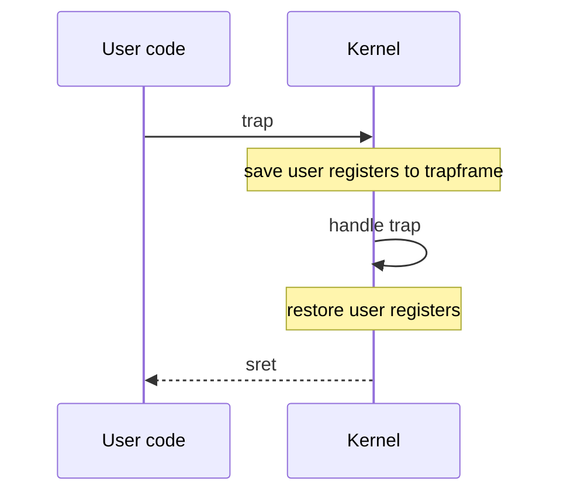
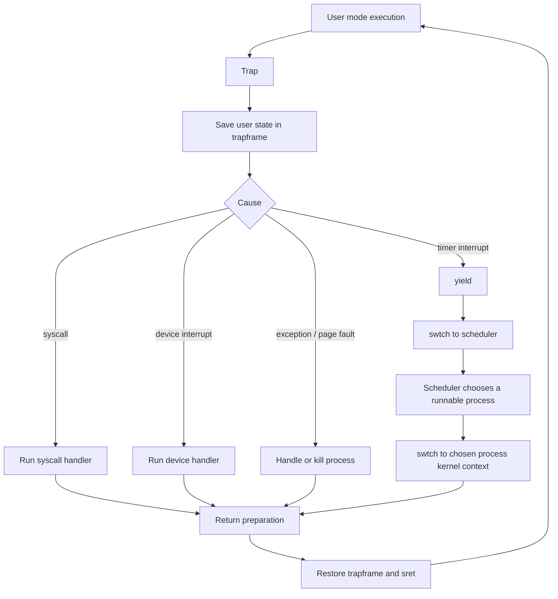
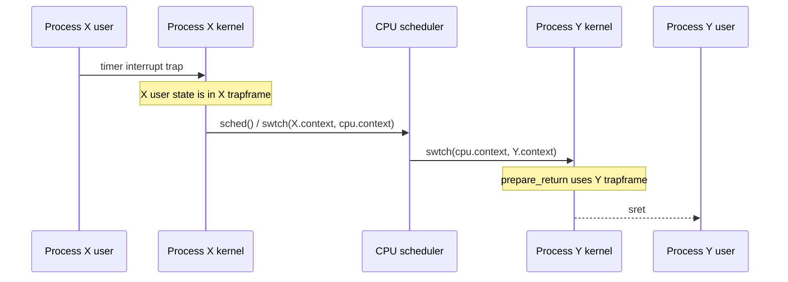
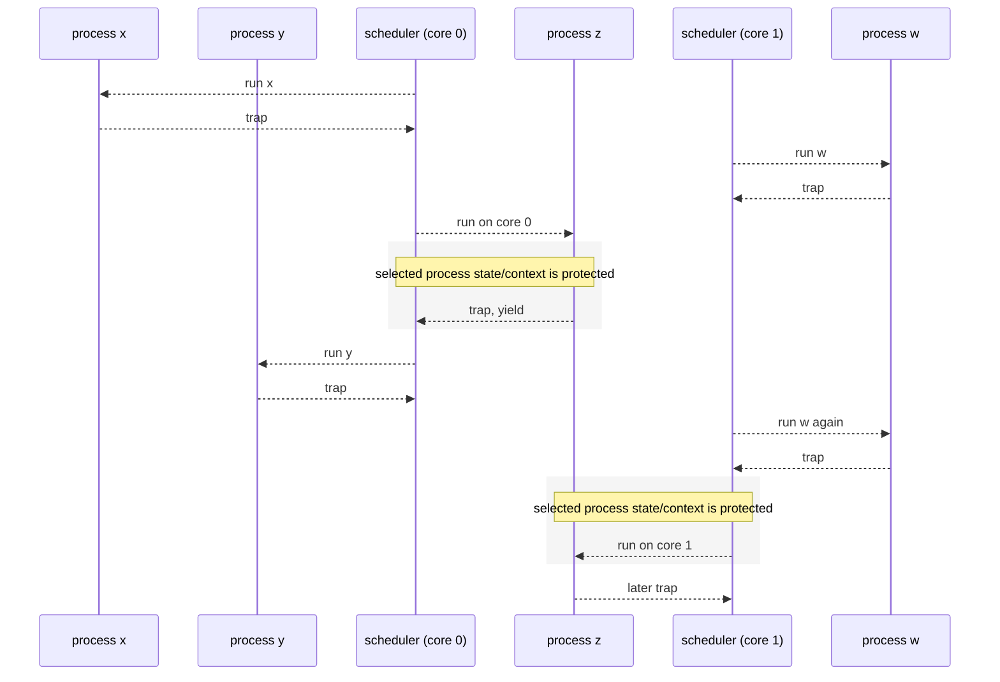

# xv6 Kernel 10 코드 정리: Context Switching

## 읽는 순서

- `docs/reference/scripts/ko/10-xv6-kernel-10-context-switching-1sSanF_y8FY.md`
- `kernel/proc.h`: `trapframe`, `context`, process/CPU state
- `kernel/proc.c`: scheduler, yield, sched
- `kernel/swtch.S`: kernel context switch
- `kernel/trampoline.S`, `kernel/trap.c`: user/kernel trap return

## 핵심

Context switching은 하나가 아니다. 강의 그림은 크게 두 층을 보여준다.

- user/kernel 전환: trap과 `sret`, user register 전체를 `trapframe`에 저장/복원
- kernel 내부 전환: `swtch()`, kernel 실행 재개에 필요한 `context`만 저장/복원

## time slice의 기본 모양

사용자 프로그램은 계속 실행되는 것처럼 보이지만, timer interrupt, syscall, device interrupt, exception
때문에 주기적으로 kernel에 들어갔다가 돌아온다.



interrupt라면 user code는 이 과정을 모른다. register와 user PC가 복원되기 때문에 원래 실행 흐름이
이어지는 것처럼 보인다.

## trap 처리의 큰 흐름

trap 원인에 따라 kernel이 하는 일이 달라진다. 단순한 device interrupt나 일부 syscall은 바로 원래
process로 돌아갈 수 있고, timer interrupt처럼 CPU를 넘겨야 하는 경우에는 scheduler로 들어간다.



현재 source 기준으로 timer interrupt는 supervisor timer interrupt로 들어오고, `devintr()`가 timer로
판별하면 `yield()`가 호출된다.

## process가 바뀌는 경우

timer interrupt가 왔다고 항상 다른 process로 바뀌는 것은 아니다. 하지만 scheduler가 다른 runnable
process를 고르면, trap으로 들어온 process X가 아니라 process Y로 `sret`할 수 있다.



이때 `trapframe`은 user mode 재개용이고, `context`는 kernel 안에서 `swtch()`로 멈췄던 지점을
이어가기 위한 저장소다.

## multi-core 관점

각 CPU는 자기 scheduler를 가진다. process는 특정 CPU에 고정되지 않고, 한 CPU에서 time slice를 받은 뒤
나중에 다른 CPU에서 다시 time slice를 받을 수 있다.



그림은 `z`를 예로 든 것이다. 실제로는 모든 process의 state/context 전환이 각자의 lock으로 보호된다.
lock은 실행 전체가 아니라 scheduler와 process가 state/context를 넘기는 구간을 보호한다.

## 정리

```text
trapframe:
  user register 전체와 user PC 저장
  user/kernel 경계에서 사용

context:
  ra, sp, s0-s11 저장
  kernel thread와 scheduler 사이 swtch에서 사용

scheduler:
  각 CPU마다 존재
  runnable process를 고르고 해당 process의 kernel context로 swtch
```

코드 확인 위치:
`kernel/proc.h`, `kernel/proc.c`, `kernel/swtch.S`, `kernel/trap.c`, `kernel/trampoline.S`
