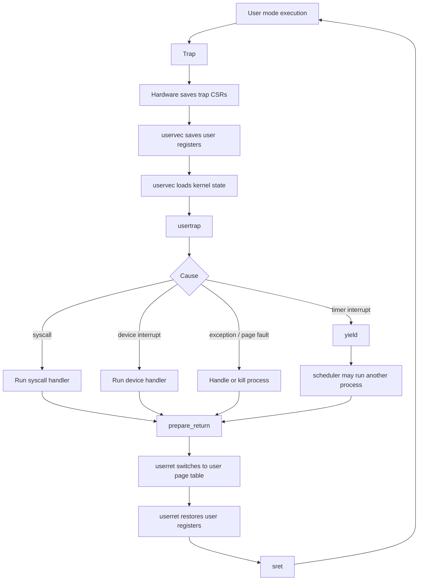

# xv6 Kernel 14 코드 정리: Trap Handling

## 읽는 순서

- `docs/reference/scripts/ko/14-xv6-kernel-14-trap-handling-k4f2vHCV5iQ.md`
- `kernel/trampoline.S`: user trap entry/return
- `kernel/trap.c`: user/kernel trap 처리
- `kernel/proc.h`: `trapframe`, `cpu`, `proc`

## 핵심

trap handling은 user mode 실행 상태를 잠시 멈추고 kernel code를 실행한 뒤, 다시 user mode로 돌아가는
경로다. 핵심은 "어떤 상태를 어디에 저장하고, 돌아갈 때 무엇을 복원하는가"다.

## user trap 흐름



timer interrupt에서 `yield()`가 호출되면 scheduler를 거쳐 다른 process가 선택될 수도 있다. 그래서 trap으로
들어온 process와 `sret`로 돌아가는 process가 항상 같다고 보면 안 된다.

## 단계별 저장/로드

```text
hardware trap:
  위치: CPU hardware, user -> supervisor 진입
  저장: 현재 PC를 sepc에 저장, trap 원인을 scause에 저장, fault 주소를 stval에 저장할 수 있음,
        이전 mode와 interrupt 상태를 sstatus에 저장
  로드: stvec에 들어 있는 handler 주소를 PC로 로드
  이유: trap handler로 들어갈 최소 상태만 CPU가 저장

uservec:
  위치: trampoline.S, supervisor mode, 아직 user page table
  저장: user register들을 현재 process의 trapframe에 저장
  로드: trapframe에서 kernel stack, hart id, usertrap 주소, kernel page table을 로드
  이유: user 상태 보존 후 kernel stack/page table/handler 준비

usertrap:
  위치: trap.c, supervisor mode, kernel page table
  저장: sepc에 있던 user PC를 trapframe->epc에 저장
  로드: scause와 stval을 읽어 syscall/device/page fault 여부 판단
  이유: syscall/interrupt/page fault를 처리하고 돌아갈 user PC 보존

prepare_return:
  위치: trap.c, supervisor mode, kernel page table
  저장: 다음 trap entry에 필요한 kernel page table, kernel stack, hart id, usertrap 주소를 trapframe에 저장
  로드: uservec 주소를 stvec에 설정하고, sret가 사용할 sstatus/sepc 값을 설정
  이유: 다음 trap entry와 이번 sret 준비

userret:
  위치: trampoline.S, supervisor mode, user page table로 전환
  로드: user page table을 satp에 로드하고, trapframe에서 user register들을 복원
  실행: sret로 user mode와 user PC로 복귀
  이유: user page table/register/PC로 복귀
```

## `trampoline.S`: entry에서 저장하고 kernel 상태 로드

trap 직후에는 아직 user page table이 켜져 있다. 그래서 `uservec`은 `TRAPFRAME` 가상 주소를 사용해 user
register를 저장하고, trapframe에 미리 적어 둔 kernel 상태를 로드한다.

```asm
uservec:
        # a0도 user register라서 바로 덮으면 안 된다.
        # sscratch에 잠시 저장한 뒤, a0를 TRAPFRAME 주소로 쓴다.
        csrw sscratch, a0
        li a0, TRAPFRAME

        # user register를 trapframe에 저장한다.
        sd ra, 40(a0)
        sd sp, 48(a0)
        sd gp, 56(a0)
        sd tp, 64(a0)
        sd a1, 120(a0)
        sd a7, 168(a0)

        # 원래 user a0도 trapframe->a0에 저장한다.
        csrr t0, sscratch
        sd t0, 112(a0)

        # kernel 실행에 필요한 상태를 trapframe에서 로드한다.
        ld sp, 8(a0)     # kernel stack
        ld tp, 32(a0)    # kernel hart id
        ld t0, 16(a0)    # usertrap()
        ld t1, 0(a0)     # kernel page table

        # kernel page table로 전환한 뒤 usertrap()으로 간다.
        sfence.vma zero, zero
        csrw satp, t1
        sfence.vma zero, zero
        jalr t0
```

## `trap.c`: 원인 처리와 return 준비

`usertrap()`은 trap 원인을 분류한다. syscall이면 `ecall` 다음 명령어로 돌아가기 위해 `epc += 4`를 하고,
timer interrupt면 `yield()`로 CPU를 양보할 수 있다.

```c++
uint64
usertrap(void)
{
  int which_dev = 0;
  struct proc *p = myproc();

  // user PC를 trapframe에 저장해 나중에 sepc로 복원한다.
  p->trapframe->epc = r_sepc();

  if (r_scause() == 8) {
    // syscall: ecall 다음 instruction으로 복귀해야 한다.
    p->trapframe->epc += 4;
    intr_on();
    syscall();
  } else if ((which_dev = devintr()) != 0) {
    // device interrupt
  } else if ((r_scause() == 15 || r_scause() == 13) &&
             vmfault(p->pagetable, r_stval(), (r_scause() == 13) ? 1 : 0) != 0) {
    // lazy page allocation 등으로 page fault를 처리한 경우
  } else {
    setkilled(p);
  }

  if (which_dev == 2)
    yield();

  prepare_return();
  return MAKE_SATP(p->pagetable);
}
```

`prepare_return()`은 다음 trap entry와 이번 `sret`에 필요한 값을 준비한다.

```c++
void
prepare_return(void)
{
  struct proc *p = myproc();

  // user mode에서 다음 trap이 나면 trampoline.S의 uservec으로 가게 한다.
  uint64 trampoline_uservec = TRAMPOLINE + (uservec - trampoline);
  w_stvec(trampoline_uservec);

  // 다음 trap entry 때 uservec이 로드할 kernel 상태를 trapframe에 저장한다.
  p->trapframe->kernel_satp = r_satp();
  p->trapframe->kernel_sp = p->kstack + PGSIZE;
  p->trapframe->kernel_trap = (uint64)usertrap;
  p->trapframe->kernel_hartid = r_tp();

  // sret가 user mode로 돌아가도록 CSR을 설정한다.
  unsigned long x = r_sstatus();
  x &= ~SSTATUS_SPP;
  x |= SSTATUS_SPIE;
  w_sstatus(x);
  w_sepc(p->trapframe->epc);
}
```

## `trampoline.S`: return에서 user 상태 복원

`userret`은 `usertrap()`이 반환한 user page table로 전환하고, trapframe에서 user register를 복원한 뒤
`sret`를 실행한다.

```asm
userret:
        # a0에는 user page table의 satp 값이 들어 있다.
        sfence.vma zero, zero
        csrw satp, a0
        sfence.vma zero, zero

        li a0, TRAPFRAME

        # user register를 trapframe에서 복원한다.
        ld ra, 40(a0)
        ld sp, 48(a0)
        ld gp, 56(a0)
        ld tp, 64(a0)
        ld a1, 120(a0)
        ld a7, 168(a0)

        # 마지막으로 user a0를 복원한다.
        ld a0, 112(a0)

        # prepare_return()이 설정한 sepc/sstatus를 사용해 user mode로 복귀한다.
        sret
```

## 관련 자료구조

```c++
struct trapframe {
  uint64 kernel_satp;   // uservec이 로드할 kernel page table
  uint64 kernel_sp;     // uservec이 로드할 kernel stack
  uint64 kernel_trap;   // usertrap()
  uint64 epc;           // saved user PC
  uint64 kernel_hartid; // uservec이 로드할 kernel tp

  // user general-purpose registers
  uint64 ra;
  uint64 sp;
  uint64 gp;
  uint64 tp;
  uint64 a0;
  uint64 a1;
  uint64 a7;
  /* ... */
};

struct cpu {
  struct proc *proc;      // 이 CPU에서 실행 중인 process
  struct context context; // scheduler context
  int noff;               // push_off nesting
  int intena;             // push_off 전 interrupt 상태
};

struct proc {
  struct spinlock lock;
  enum procstate state;
  uint64 kstack;
  pagetable_t pagetable;
  struct trapframe *trapframe;
  struct context context;
};
```

`trapframe`은 user/kernel 경계의 저장소이고, `context`는 scheduler와 process kernel thread 사이의
저장소다. 둘은 저장하는 목적과 register 범위가 다르다.

코드 확인 위치:
`kernel/proc.h`, `kernel/trap.c`, `kernel/trampoline.S`
