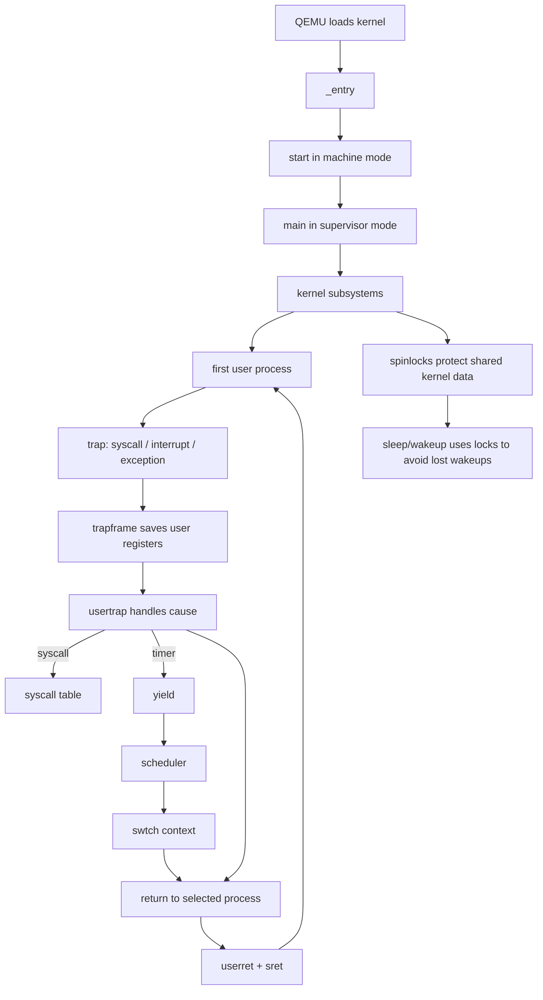
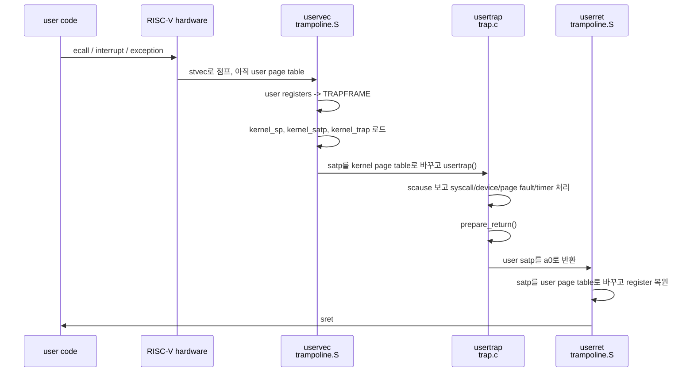
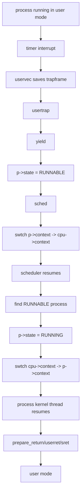
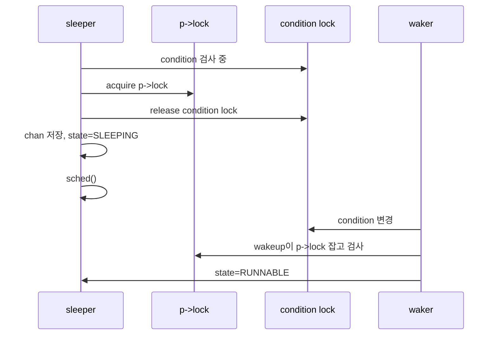

# xv6 1-17강 전체 정리: 실행 모델

## 범위

대상 독자는 scheduler, trap, VM의 개념은 알지만 xv6 코드를 처음 보는 사람이다. 목표는 모든 코드를 외우는
것이 아니라, 실제 소스를 열었을 때 "이 코드가 왜 여기 있고, 어떤 흐름에서 실행되는지"를 유추할 수 있게
하는 것이다.

이 문서는 1-17강 범위만 다룬다. UART/console, VM 함수 전체 walkthrough, fork/exit/wait/exec, sleeplock,
PLIC, file system, pipe, file descriptor는 뒤 강의에서 다루므로 여기서는 필요한 연결점만 언급한다.

검증 기준:

- 강의 스크립트: `docs/reference/scripts/ko/01-...`부터 `17-...`까지
- 기존 AI 정리: `docs/ai/001_...`부터 `docs/ai/016_...`까지
- xv6 book: <https://xv6-guide.github.io/xv6-riscv-book/>
- 현재 repo 소스: `kernel/entry.S`, `kernel/start.c`, `kernel/main.c`, `kernel/spinlock.c`,
  `kernel/kalloc.c`, `kernel/vm.c`, `kernel/proc.c`, `kernel/proc.h`, `kernel/trap.c`,
  `kernel/trampoline.S`, `kernel/swtch.S`, `kernel/syscall.c`

현재 repo 차이:

- 책과 일부 강의는 `usertrapret()`을 말하지만, 현재 repo는 그 역할을 `prepare_return()`과
  `usertrap()`의 반환 흐름으로 나눈다.
- 일부 강의는 machine `timervec` 경유 timer interrupt를 설명하지만, 현재 repo는 Sstc를 켜고
  supervisor `stimecmp`를 직접 사용한다.
- 현재 repo의 user-level sleep syscall 이름은 `sleep`이 아니라 `pause`다. kernel primitive는 여전히
  `sleep(chan, lock)`이다.

## 전체 지도



한 줄로 줄이면 다음 흐름이다.

```text
boot -> kernel init -> page tables -> user process
     -> trap/syscall/interrupt -> scheduler/context switch -> sleep/wakeup
```

## 0. 치트시트

### 주요 register

| 이름 | 의미 | xv6에서 자주 보이는 곳 |
| --- | --- | --- |
| `sp` | 현재 stack pointer | `_entry`가 hart별 stack 설정, `swtch()`가 kernel stack 전환 |
| `ra` | return address | `swtch()`가 저장/복원해서 다른 실행 흐름으로 `ret` |
| `a0-a7` | 함수 인자와 return 값 | syscall 인자, syscall 번호는 `a7`, 반환값은 `a0` |
| `s0-s11` | callee-saved register | `swtch.S`가 kernel context로 저장 |
| `t0-t6` | temporary register | trampoline assembly의 임시 계산 |
| `tp` | thread pointer | xv6는 hart id를 저장해 `cpuid()`에서 사용 |
| `pc` | program counter | trap 때 `sepc`에 저장되고, `sret` 때 복귀 |

### 주요 CSR

| CSR | 의미 | 코드 위치 |
| --- | --- | --- |
| `mstatus` | machine mode 상태, `MPP`가 `mret` 이후 mode를 결정 | `kernel/start.c:start()` |
| `mepc` | `mret`가 이동할 PC | `kernel/start.c:start()` |
| `satp` | 현재 page table | `kernel/vm.c:kvminithart()`, `kernel/trampoline.S:uservec/userret` |
| `stvec` | supervisor trap handler 주소 | `kernel/trap.c:trapinithart()`, `prepare_return()` |
| `sepc` | trap 전 user PC | `kernel/trap.c:usertrap()`, `prepare_return()` |
| `scause` | trap 원인 | `kernel/trap.c:usertrap()`, `devintr()` |
| `stval` | page fault 등에서 fault 관련 주소 | `kernel/trap.c:usertrap()` |
| `sstatus` | supervisor mode/interrupt 상태 | `kernel/trap.c:usertrap()`, `prepare_return()` |
| `sscratch` | trap entry assembly의 임시 저장소 | `kernel/trampoline.S:uservec` |
| `stimecmp` | 다음 supervisor timer interrupt 시점 | `kernel/start.c:timerinit()`, `kernel/trap.c:clockintr()` |

### 주요 구조체

| 구조체 | 핵심 역할 | 코드 위치 |
| --- | --- | --- |
| `struct spinlock` | shared kernel data 보호 | `kernel/spinlock.h`, `kernel/spinlock.c` |
| `struct cpu` | CPU별 scheduler context, 현재 실행 process, interrupt nesting | `kernel/proc.h:21` |
| `struct proc` | process의 kernel-side 상태 | `kernel/proc.h:81` |
| `struct trapframe` | user register와 다음 trap entry에 필요한 kernel 상태 저장 | `kernel/proc.h:40` |
| `struct context` | scheduler와 process kernel thread 사이의 `swtch()` 저장소 | `kernel/proc.h:2` |

`trapframe`과 `context`를 섞으면 이후 코드가 헷갈린다.

```text
trapframe:
  user <-> kernel 경계에서 사용
  user register 전체 + user PC + 다음 trap entry용 kernel 상태

context:
  kernel thread <-> scheduler thread 사이에서 사용
  ra, sp, s0-s11만 저장
```

## 1. spinlock을 먼저 봐야 하는 이유

spinlock은 뒤 코드의 공통 전제다. `kalloc()`의 freelist, process state, scheduler handoff,
sleep/wakeup의 lost wakeup 방지까지 전부 lock을 사용한다. lock을 모르면 뒤에서 "왜 여기서 interrupt를
끄는지", "왜 `p->lock`을 잡은 채 `swtch()`하는지"를 해석하기 어렵다.

### 기본 의미

```text
acquire(lock):
  interrupt를 끄고
  atomic exchange로 locked가 0이 될 때까지 spin
  잡은 CPU를 기록

release(lock):
  잡은 CPU 기록 제거
  locked를 0으로 atomic store
  필요하면 interrupt 복구
```

확인할 코드:

- `kernel/spinlock.c:initlock()`
- `kernel/spinlock.c:acquire()`
- `kernel/spinlock.c:release()`
- `kernel/spinlock.c:push_off()`
- `kernel/spinlock.c:pop_off()`

`acquire()`가 `push_off()`를 먼저 호출하는 이유는 같은 CPU에서 interrupt handler가 같은 lock을 다시 잡아
deadlock에 빠지는 상황을 막기 위해서다. `push_off()`/`pop_off()`는 중첩 횟수(`cpu.noff`)와 이전 interrupt
상태(`cpu.intena`)를 기억한다.

### 어떤 lock이 무엇을 보호하는가

| lock | 보호 대상 | 대표 코드 |
| --- | --- | --- |
| `kmem.lock` | free physical page list | `kernel/kalloc.c:kalloc()`, `kfree()` |
| `p->lock` | `state`, `chan`, `killed`, context handoff | `kernel/proc.c:scheduler()`, `sleep()`, `wakeup()` |
| `tickslock` | `ticks` counter | `kernel/trap.c:clockintr()` |
| `wait_lock` | parent/child 관계와 wait wakeup | `kernel/proc.c:kwait()`, `kexit()` |

`p->lock`은 특히 중요하다. scheduler와 process가 `swtch()`를 사이에 두고 lock을 넘겨받는 구조라서,
보통 코드처럼 "잡은 함수가 같은 함수에서 푼다"는 모양이 아니다.

## 2. 부팅: QEMU에서 `main()`까지

```mermaid
flowchart LR
  A[QEMU loads kernel at 0x80000000] --> B[_entry<br/>kernel/entry.S]
  B --> C[hart별 stack 설정]
  C --> D[start()<br/>machine mode]
  D --> E[mstatus.MPP = S<br/>mepc = main]
  E --> F[timer/PMP/delegation 준비]
  F --> G[mret]
  G --> H[main()<br/>supervisor mode]
  H --> I[init subsystems]
  I --> J[scheduler()]
```

읽을 코드:

- `kernel/entry.S:_entry`
- `kernel/start.c:start()`
- `kernel/start.c:timerinit()`
- `kernel/main.c:main()`

핵심은 C 코드를 부르려면 stack이 먼저 필요하다는 점이다. 그래서 `_entry`는 `mhartid`를 읽어 hart별
4KB stack을 고른 뒤 `start()`를 호출한다.

`start()`는 machine mode에서 실행되며 `mret` 후 supervisor mode의 `main()`으로 가도록 상태를 만든다.

```text
start():
  mstatus.MPP = supervisor
  mepc = main
  satp = 0
  medeleg/mideleg = supervisor로 위임
  PMP = supervisor가 physical memory 접근 가능
  timerinit()
  tp = hart id
  mret
```

`main()`은 CPU 0에서 대부분의 전역 subsystem을 초기화하고, 다른 CPU들은 `started`를 기다린 뒤 자기 hart
설정을 한다. 마지막은 모든 CPU가 `scheduler()`로 들어간다.

## 3. 메모리: page table을 깊게 보기 전 필요한 모델

1-17강 범위에서는 VM 함수 하나하나보다 주소 공간의 모양이 중요하다.

```text
physical memory
  0x10000000              UART MMIO
  0x10001000              virtio MMIO
  0x80000000 KERNBASE     kernel text/data starts
  end                     kalloc() free pages start
  PHYSTOP                 xv6가 쓰는 RAM 끝
```

```text
user virtual address space, high end

MAXVA
  +---------------------+
  | TRAMPOLINE          | same physical page for all processes
  +---------------------+
  | TRAPFRAME           | same VA, different physical page per process
  +---------------------+
  | user heap / stack   |
  | text / data         |
  +---------------------+
0
```

읽을 코드:

- `kernel/memlayout.h`: `KERNBASE`, `PHYSTOP`, `TRAMPOLINE`, `TRAPFRAME`
- `kernel/kalloc.c:kinit()`, `kalloc()`, `kfree()`
- `kernel/vm.c:kvmmake()`, `kvminithart()`, `walk()`, `mappages()`
- `kernel/proc.c:proc_pagetable()`

`kalloc()`은 4096 byte physical page 하나를 freelist에서 꺼낸다. freelist는 shared data라서
`kmem.lock`으로 보호한다.

kernel page table은 대체로 physical memory를 같은 virtual address로 direct-map한다. 예외적으로
`TRAMPOLINE`은 높은 virtual address에도 매핑한다. user page table도 `TRAMPOLINE`과 `TRAPFRAME`을 높은
주소에 매핑한다. 이 때문에 trap entry/return 중 page table이 바뀌어도 trampoline code가 계속 실행된다.

## 4. trap과 syscall

trap은 ordinary instruction stream에서 kernel handler로 강제 이동하는 사건이다. syscall, exception,
device interrupt가 모두 trap이다.

RISC-V hardware가 trap 때 해주는 일은 최소한이다.

```text
hardware trap:
  interrupt disable
  pc -> sepc
  이전 mode -> sstatus.SPP
  원인 -> scause
  mode -> supervisor
  stvec -> pc

hardware가 하지 않는 일:
  page table 전환 안 함
  kernel stack 전환 안 함
  general-purpose register 저장 안 함
```

그래서 xv6가 assembly trampoline을 둔다.



읽을 코드:

- `kernel/trampoline.S:uservec`
- `kernel/trap.c:usertrap()`
- `kernel/trap.c:prepare_return()`
- `kernel/trampoline.S:userret`
- `kernel/syscall.c:syscall()`
- `user/usys.pl`

### syscall 경로

user stub은 syscall 번호를 `a7`에 넣고 `ecall`한다. trap으로 kernel에 들어오면 `usertrap()`이
`scause == 8`을 보고 syscall로 판단한다. syscall 인자는 trapframe에 저장된 `a0-a5`에서 읽고, syscall
번호는 `a7`에서 읽는다. 반환값은 `trapframe->a0`에 쓴다.

```text
user function
  -> user/usys.pl generated stub: a7 = SYS_xxx, ecall
  -> uservec saves a0-a7 into trapframe
  -> usertrap sees scause == 8
  -> syscall() dispatches syscalls[a7]
  -> return value stored in trapframe->a0
  -> userret restores a0
```

syscall의 `ecall`은 다시 실행하면 안 되므로 `usertrap()`은 `trapframe->epc += 4`를 한다. 그렇지 않으면
`sret` 후 같은 `ecall`에서 다시 trap이 난다.

### timer interrupt와 scheduler 연결

현재 repo는 `start.c:timerinit()`에서 Sstc를 켜고 `stimecmp`를 설정한다. timer interrupt가 들어오면
`trap.c:devintr()`이 `clockintr()`를 호출하고, user trap 경로에서는 `which_dev == 2`일 때 `yield()`로
CPU를 양보한다.

## 5. context switch와 scheduling

trap에서 user register를 저장하는 것과 scheduler가 kernel 실행 흐름을 바꾸는 것은 다른 문제다.

```text
trapframe:
  user로 돌아가기 위한 register snapshot

context:
  kernel thread가 나중에 다시 ret로 재개되기 위한 minimal snapshot
```

전체 흐름:



읽을 코드:

- `kernel/proc.c:scheduler()`
- `kernel/proc.c:yield()`
- `kernel/proc.c:sched()`
- `kernel/swtch.S:swtch`
- `kernel/proc.h:struct context`, `struct cpu`, `struct proc`

`swtch(old, new)`는 `a0=old`, `a1=new`를 받는다. 현재 `ra`, `sp`, `s0-s11`을 `old`에 저장하고, `new`에서
같은 register들을 로드한 뒤 `ret`한다. `ret`의 목적지는 새로 로드한 `ra`가 결정하므로, 함수처럼 보이지만
돌아가는 실행 흐름이 바뀐다.

`scheduler()`는 CPU별로 존재한다. runnable process를 찾으면 `p->lock`을 잡은 상태에서 `p->state`를
`RUNNING`으로 바꾸고 `swtch(&c->context, &p->context)`를 호출한다. process가 나중에 `yield()`,
`sleep()`, `kexit()` 등으로 `sched()`에 들어오면 `swtch(&p->context, &mycpu()->context)`로 scheduler에
돌아온다.

## 6. sleep/wakeup

`sleep(chan, lock)`은 "조건이 아직 만족되지 않았으니 CPU를 포기하고 기다린다"는 kernel primitive다.
`wakeup(chan)`은 같은 channel에서 자는 process를 `RUNNABLE`로 바꾼다.

```text
일반 패턴:

acquire(condition_lock)
while condition is false:
  sleep(channel, condition_lock)
release(condition_lock)
```

channel은 값 자체에 특별한 의미가 없다. xv6는 보통 기다리는 shared object의 주소를 channel로 쓴다.
예를 들어 timer sleep은 `&ticks`를 channel로 쓴다.

읽을 코드:

- `kernel/proc.c:sleep()`
- `kernel/proc.c:wakeup()`
- `kernel/trap.c:clockintr()`
- `kernel/sysproc.c:sys_pause()`

### lost wakeup 문제

아래 순서가 가능하면 process는 영원히 잘 수 있다.

```text
consumer: condition false 확인
producer: condition true로 변경
producer: wakeup(chan)
consumer: sleep(chan)에 들어감
```

이미 wakeup이 지나갔으므로 consumer는 깨지지 않는다.

xv6의 `sleep()`은 이 틈을 막기 위해 caller의 condition lock을 바로 놓지 않는다. 먼저 `p->lock`을 잡고,
그 다음 condition lock을 놓고, `p->chan`과 `p->state = SLEEPING`을 설정한 뒤 `sched()`한다.



핵심은 sleeper가 조건을 검사한 뒤 완전히 sleeping 상태가 될 때까지 condition lock 또는 `p->lock` 중
하나는 계속 잡고 있다는 점이다.

## 7. 코드 읽는 추천 순서

처음부터 모든 파일을 위에서 아래로 읽기보다, 아래 순서로 보면 연결이 잘 잡힌다.

1. `kernel/spinlock.c`: lock, interrupt disable의 기본
2. `kernel/entry.S`, `kernel/start.c`, `kernel/main.c`: kernel이 어떻게 시작되는지
3. `kernel/memlayout.h`, `kernel/kalloc.c`, `kernel/vm.c`: 주소 공간의 최소 모델
4. `kernel/proc.h`: `trapframe`, `context`, `cpu`, `proc`
5. `kernel/trampoline.S`, `kernel/trap.c`, `kernel/syscall.c`: user/kernel 경계
6. `kernel/proc.c:scheduler()`, `yield()`, `sched()`, `sleep()`, `wakeup()`: 실행 흐름 전환과 대기
7. `kernel/swtch.S`: context switch가 실제 register를 어떻게 바꾸는지

## 8. 나중에 따로 볼 것

이 문서에서 일부러 깊게 다루지 않은 부분이다.

- 18강 UART/console: device interrupt의 구체적 예
- 19-20강 VM functions: `walk()`, `mappages()`, `uvmalloc()` 등 상세
- 21-24강 process lifecycle: `fork`, `exit`, `wait`, `kill`
- 25강 sleeplock: sleep 가능한 lock
- 26-27강 kernel trap, PLIC: kernel mode trap과 interrupt controller
- 28강 이후: buffer cache, log, file system, pipe, file descriptor, exec

1-17강의 목적은 위 세부 주제로 들어가기 전에, xv6가 "어떻게 부팅하고, 어떻게 user/kernel을 오가며,
어떻게 CPU를 넘기고, 어떻게 안전하게 기다리는지"라는 실행 모델을 세우는 것이다.
